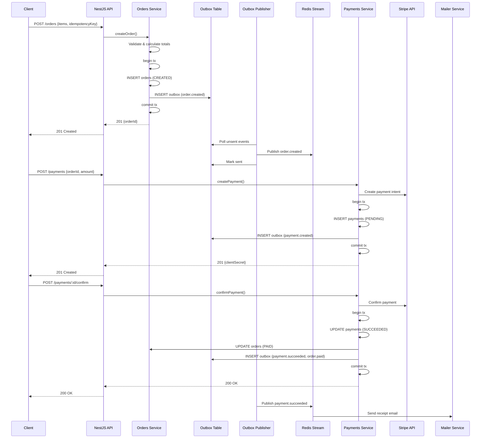

# 🏗️ Complete E-Commerce Architecture & Core Workflow

> **Complete System Documentation** — Detailed sequence diagrams, component descriptions, API contracts, database schemas, worker responsibilities, Redis patterns, observability, testing plans, and implementation checklists for the fully implemented e-commerce backend.

**Tech Stack:** NestJS · PostgreSQL · Prisma · Redis · BullMQ · Stripe · Prometheus · Pino

---

## 📋 Table of Contents

1. [Complete Checkout Flow Sequence Diagram](#1-complete-checkout-flow-sequence-diagram)
2. [Component Responsibilities](#2-component-responsibilities)
3. [API Contracts](#3-api-contracts)
4. [Database Schemas](#4-database-schemas)
5. [Worker Designs & Algorithms](#5-worker-designs--algorithms)
6. [Redis Usage Patterns](#6-redis-usage-patterns)
7. [Observability & Tracing](#7-observability--tracing)
8. [Testing & Validation Plan](#8-testing--validation-plan)
9. [Operational Runbooks](#9-operational-runbooks)
10. [Implementation Checklist](#10-implementation-checklist)

---

## 1. Complete Checkout Flow Sequence Diagram

### 1.1 Full E-Commerce Checkout Flow (When Fully Implemented)

### 1.2 Simplified Current Implementation Flow


 Work flow diagram:
 
---

## 2. Component Responsibilities

### 2.1 Core Services

| Component | Responsibility | Technology | Status |
|-----------|---------------|------------|--------|
| **NestJS API** | Request validation, authentication, orchestration | NestJS, TypeScript | ✅ Complete |
| **Auth Service** | JWT authentication, refresh tokens, RBAC | Passport, JWT | ✅ Complete |
| **Orders Service** | Order lifecycle, state machine, idempotency | Prisma, PostgreSQL | ✅ Complete |
| **Payments Service** | Payment processing, provider abstraction | Stripe, Prisma | ✅ Complete |
| **Outbox Service** | Event storage in same transaction | Prisma, PostgreSQL | ✅ Complete |
| **Outbox Publisher Worker** | Poll and publish events to event bus | Node.js, Redis Stream | ✅ Complete |
| **Event Bus** | Event routing and distribution | Redis Stream (dev), Kafka (prod) | ✅ Complete |
| **Mailer Service** | Async email sending | BullMQ, Nodemailer | ✅ Complete |

### 2.2 Future Components (To Be Implemented)

| Component | Responsibility | Technology | Status |
|-----------|---------------|------------|--------|
| **Cart Service** | Anonymous & authenticated cart management | Redis, Prisma | ⏳ Phase 2 |
| **Inventory Service** | Stock management, reservations | Redis, PostgreSQL | ⏳ Phase 2 |
| **Shipping Service** | Label generation, tracking | External APIs | ⏳ Phase 7 |
| **Analytics Sink** | Event ingestion for reporting | ClickHouse, S3 | ⏳ Phase 5 |
| **Fulfillment Workers** | Order processing, shipping | BullMQ | ⏳ Phase 3 |

### 2.3 Infrastructure Components

| Component | Purpose | Implementation |
|-----------|---------|----------------|
| **PostgreSQL** | Source of truth for orders, payments, users | Prisma ORM |
| **Redis** | Caching, rate limiting, BullMQ queues, event bus | ioredis |
| **Prometheus** | Metrics collection | `/metrics` endpoint |
| **Pino Logger** | Structured JSON logging | Global logger |
| **Request ID Middleware** | Request correlation across services | Custom middleware |

---

## 3. API Contracts

### 3.1 Order Endpoints

#### POST /orders
**Create a new order**

**Request:**
```json
{
  "items": [
    { "sku": "TSHIRT-SM-RED", "quantity": 2 },
    { "sku": "TSHIRT-MD-BLUE", "quantity": 1 }
  ],
  "idempotencyKey": "unique-key-123" // Optional
}
```

**Response:** `201 Created`
```json
{
  "success": true,
  "data": {
    "id": "order-uuid",
    "userId": "user-uuid",
    "totalAmount": "99.99",
    "status": "CREATED",
    "items": [...],
    "createdAt": "2025-11-12T10:00:00.000Z"
  }
}
```

**Behavior:**
- Validates items (checks SKUs exist, calculates prices)
- Checks idempotency key (returns existing order if duplicate)
- Creates order in transaction
- Writes `order.created` event to Outbox
- Returns order immediately (async event processing)

#### GET /orders/:id
**Get order by ID**

**Response:** `200 OK`
```json
{
  "success": true,
  "data": {
    "id": "order-uuid",
    "status": "PAID",
    "totalAmount": "99.99",
    ...
  }
}
```

**Security:** Users can only access their own orders (enforced in service layer)

#### PATCH /orders/:id/status
**Update order status (Admin/Manager only)**

**Request:**
```json
{
  "status": "SHIPPED"
}
```

**Valid Transitions:**
- `CREATED` → `PAID` (via payment)
- `CREATED` → `CANCELLED`
- `PAID` → `SHIPPED`
- `SHIPPED` → `DELIVERED`
- `PAID` → `CANCELLED`

### 3.2 Payment Endpoints

#### POST /payments
**Create payment intent**

**Request:**
```json
{
  "orderId": "order-uuid",
  "amount": 99.99,
  "currency": "USD",
  "paymentMethodType": "card",
  "customerEmail": "customer@example.com",
  "paymentMethodId": "pm_xxx" // Optional
}
```

**Response:** `201 Created`
```json
{
  "success": true,
  "data": {
    "id": "payment-uuid",
    "orderId": "order-uuid",
    "paymentIntentId": "pi_xxx",
    "clientSecret": "pi_xxx_secret_xxx",
    "status": "PENDING",
    "amount": 99.99,
    "currency": "USD"
  }
}
```

**Behavior:**
- Validates order exists and is in `CREATED` status
- Validates amount matches order total
- Creates payment intent via Stripe
- Stores payment record in database
- Writes `payment.created` event to Outbox

#### POST /payments/:id/confirm
**Confirm payment**

**Request:**
```json
{
  "paymentMethodId": "pm_xxx"
}
```

**Response:** `200 OK`
```json
{
  "success": true,
  "data": {
    "status": "SUCCEEDED",
    "paymentIntentId": "pi_xxx"
  }
}
```

**Behavior:**
- Confirms payment intent via Stripe
- Updates payment status to `SUCCEEDED`
- Updates order status to `PAID`
- Writes `payment.succeeded` and `order.paid` events

#### POST /payments/webhook
**Process Stripe webhook (Public endpoint, signature verified)**

**Request Headers:**
```
stripe-signature: t=timestamp,v1=signature
```

**Request Body:** Stripe webhook payload

**Response:** `200 OK`

**Behavior:**
- Verifies webhook signature
- Checks idempotency (`webhookEventId`)
- Processes `payment_intent.succeeded` or `payment_intent.payment_failed`
- Updates payment and order status
- Emits events

### 3.3 Health & Monitoring

#### GET /health
**Health check endpoint**

**Response:** `200 OK`
```json
{
  "status": "healthy",
  "database": "connected",
  "redis": "connected",
  "timestamp": "2025-11-12T10:00:00.000Z"
}
```

#### GET /metrics
**Prometheus metrics endpoint**

**Response:** Prometheus format metrics

---

## 4. Database Schemas

### 4.1 Orders Schema (Prisma)

```prisma
model Order {
  id             String      @id @default(uuid())
  userId         String
  totalAmount    Decimal     @db.Decimal(10, 2)
  status         OrderStatus @default(CREATED)
  idempotencyKey String?     @unique
  createdAt      DateTime    @default(now())
  updatedAt      DateTime    @updatedAt

  user     User      @relation(fields: [userId], references: [id])
  payments Payment[]

  @@index([userId])
  @@index([status])
  @@index([idempotencyKey])
  @@map("orders")
}

enum OrderStatus {
  CREATED   // Order created, payment pending
  PAID      // Payment succeeded
  SHIPPED   // Order shipped
  DELIVERED // Order delivered
  CANCELLED // Order cancelled
}
```

### 4.2 Payments Schema (Prisma)

```prisma
model Payment {
  id                String        @id @default(uuid())
  orderId           String
  paymentIntentId   String        @unique
  provider          String        // "stripe", "paypal", etc.
  amount            Decimal       @db.Decimal(10, 2)
  currency          String        @default("USD")
  status            PaymentStatus @default(PENDING)
  idempotencyKey    String?       @unique
  webhookEventId    String?       @unique // For webhook idempotency
  metadata          Json?
  createdAt         DateTime      @default(now())
  updatedAt         DateTime      @updatedAt

  order Order @relation(fields: [orderId], references: [id])

  @@index([orderId])
  @@index([paymentIntentId])
  @@index([status])
  @@map("payments")
}

enum PaymentStatus {
  PENDING    // Payment created
  PROCESSING // Payment processing
  SUCCEEDED  // Payment succeeded
  FAILED     // Payment failed
  CANCELLED  // Payment cancelled
  REFUNDED   // Payment refunded
}
```

### 4.3 Outbox Schema (Prisma)

```prisma
model Outbox {
  id        String   @id @default(uuid())
  topic     String   // Event topic (e.g., "order.created")
  payload   Json     // Full event envelope
  createdAt DateTime @default(now())
  sentAt    DateTime? // When published (null = not yet sent)
  attempts  Int      @default(0) // Retry count
  locked    Boolean  @default(false) // Lock for worker processing

  @@index([createdAt]) // For polling unsent events
  @@index([sentAt])    // For cleanup
  @@index([locked])    // For finding unlocked events
  @@map("outbox")
}
```

### 4.4 Inventory Reservations Schema (Prisma)

```prisma
model InventoryReservation {
  id        String                  @id @default(uuid())
  skuId     String
  quantity  Int
  reservedBy String                 // Order ID or session ID
  status    InventoryReservationStatus @default(RESERVED)
  expiresAt DateTime
  createdAt DateTime                @default(now())
  updatedAt DateTime                @updatedAt

  productVariant ProductVariant @relation(fields: [skuId], references: [id])

  @@index([skuId])
  @@index([reservedBy])
  @@index([status])
  @@index([expiresAt])
  @@map("inventory_reservations")
}

enum InventoryReservationStatus {
  RESERVED  // Stock reserved
  RELEASED  // Reservation released
  CONSUMED  // Reservation consumed (order paid)
}
```

---

## 5. Worker Designs & Algorithms

### 5.1 Outbox Publisher Worker

**Pattern:** Poll-based event publishing

**Algorithm:**
1. Poll Outbox table every 5 seconds (configurable)
2. Select unsent events: `WHERE sentAt IS NULL AND locked = false LIMIT 100`
3. Lock events: `UPDATE ... SET locked = true WHERE id IN (...) FOR UPDATE SKIP LOCKED`
4. Publish each event to Redis Stream: `XADD events:{topic} * payload {json}`
5. On success: `UPDATE ... SET sentAt = NOW(), locked = false`
6. On failure: `UPDATE ... SET attempts = attempts + 1, locked = false`
7. If `attempts > MAX_ATTEMPTS`: Move to DLQ (Dead Letter Queue)

**Concurrency:** Multiple instances can run; `SKIP LOCKED` prevents duplicate processing

**Configuration:**
- `OUTBOX_POLLING_INTERVAL`: 5000ms (5 seconds)
- `OUTBOX_BATCH_SIZE`: 100 events per poll
- `OUTBOX_MAX_ATTEMPTS`: 5 attempts before DLQ

### 5.2 Inventory Reservation Worker (Future)

**Pattern:** TTL-based reservation expiration

**Algorithm:**
1. Periodically scan `inventory_reservations` where `expiresAt < NOW()` and `status = RESERVED`
2. Release stock: `UPDATE ... SET status = RELEASED`
3. Update product variant stock: `UPDATE product_variants SET stock = stock + quantity`
4. Emit `inventory.released` event

**Alternative:** Use Redis keyspace notifications to detect TTL expiration

### 5.3 Webhook Retry Worker (Future)

**Pattern:** BullMQ job queue with exponential backoff

**Algorithm:**
1. Store webhook jobs in BullMQ queue
2. Retry N times with exponential backoff: `1s, 2s, 4s, 8s, 16s`
3. If all retries fail: Send alert and push to DLQ
4. Idempotency: Check `webhookEventId` before processing

---

## 6. Redis Usage Patterns

### 6.1 Event Bus (Redis Stream)

**Pattern:** Redis Streams for event publishing

**Commands:**
```redis
# Publish event
XADD events:order.created * event_id <uuid> payload <json>

# Consume events (consumer group)
XREADGROUP GROUP workers consumer1 STREAMS events:order.created 0

# Acknowledge event
XACK events:order.created workers <message-id>
```

**Stream Keys:**
- `events:order.created`
- `events:order.paid`
- `events:payment.created`
- `events:payment.succeeded`
- `events:payment.failed`

### 6.2 Rate Limiting

**Pattern:** Token bucket with Redis

**Implementation:** `rate-limiter-flexible` package

**Keys:**
- `rate_limit:login:{ip}:{email}`
- `rate_limit:register:{ip}`
- `rate_limit:refresh:{ip}:{token}`

### 6.3 BullMQ Queues

**Pattern:** Job queues for async processing

**Queues:**
- `mail` - Email sending jobs
- `webhook-retry` - Webhook retry jobs (future)
- `fulfillment` - Order fulfillment jobs (future)

### 6.4 Inventory Reservations (Future)

**Pattern:** Redis TTL for reservation expiration

**Commands:**
```redis
# Reserve stock
SET reservation:{sku}:{orderId} {quantity} EX 900 NX

# Check reservation
GET reservation:{sku}:{orderId}

# Release reservation
DEL reservation:{sku}:{orderId}
```

**TTL:** 900 seconds (15 minutes) - matches checkout timeout

### 6.5 Distributed Locks

**Pattern:** Redis SET with NX and PX

**Commands:**
```redis
# Acquire lock
SET lock:key token NX PX 10000

# Release lock
DEL lock:key
```

**Use Cases:**
- Preventing concurrent order processing
- Inventory reservation locking
- Worker coordination

---

## 7. Observability & Tracing

### 7.1 Request Correlation

**Headers:**
- `X-Request-Id`: Unique request identifier (generated by middleware)
- `X-Trace-Id`: OpenTelemetry trace ID (for distributed tracing)

**Propagation:**
- Included in all log entries
- Included in event payloads (`request_id`, `trace_id`)
- Propagated across service boundaries

### 7.2 Structured Logging (Pino)

**Format:** JSON logs

**Example:**
```json
{
  "level": "info",
  "time": 1699795200000,
  "msg": "Order created successfully",
  "service": "OrdersService",
  "requestId": "req-123",
  "traceId": "00-4bf92f3577b34da6a3ce929d0e0e4736-00f067aa0ba902b7-01",
  "userId": "user-456",
  "orderId": "order-789",
  "amount": 99.99
}
```

**Log Levels:**
- `error`: Errors and exceptions
- `warn`: Warnings (rate limits, failed operations)
- `info`: Important operations (order created, payment succeeded)
- `debug`: Detailed debugging information

### 7.3 Prometheus Metrics

**HTTP Metrics:**
- `http_request_duration_seconds` - Request latency (histogram)
- `http_requests_total` - Request count (counter)
- `http_request_failures_total` - Failed requests (counter)

**Business Metrics:**
- `orders_created_total{status}` - Orders created (counter)
- `orders_by_status{status}` - Current order count by status (gauge)
- `payments_created_total{provider}` - Payment intents created (counter)
- `payments_succeeded_total{provider}` - Successful payments (counter)
- `payments_failed_total{provider,reason}` - Failed payments (counter)

**Event Metrics:**
- `outbox_events_published_total{topic}` - Events published (counter)
- `outbox_events_failed_total{topic}` - Failed event publishing (counter)
- `outbox_backlog_size` - Unsent events count (gauge)

**Rate Limiting Metrics:**
- `rate_limit_blocks_total{endpoint,type}` - Rate limit blocks (counter)

**Query Examples:**
```promql
# Orders created per hour
rate(orders_created_total[1h])

# Payment success rate
rate(payments_succeeded_total[5m]) / rate(payments_created_total[5m])

# Outbox backlog
outbox_backlog_size

# Average request latency (p95)
histogram_quantile(0.95, http_request_duration_seconds_bucket)
```

### 7.4 Distributed Tracing (OpenTelemetry)

**Future Implementation:**
- OpenTelemetry instrumentation for HTTP and database
- Jaeger/Tempo for trace storage
- 100% sampling in staging, 1-5% in production

**Trace Context:**
- Propagated via `X-Trace-Id` header
- Included in event payloads
- Correlates requests across services

---

## 8. Testing & Validation Plan

### 8.1 Unit Tests

**Coverage Targets:**
- Business logic: 80%+ coverage
- Critical paths (payments, orders): 100% coverage

**Test Areas:**
- Order creation with idempotency
- Order status state machine transitions
- Payment processing and webhook handling
- Event creation and validation
- Price calculation
- Cart merge logic (future)

**Example:**
```typescript
describe('OrdersService', () => {
  it('should create order with idempotency key', async () => {
    const order1 = await service.create({ idempotencyKey: 'key-123', ... });
    const order2 = await service.create({ idempotencyKey: 'key-123', ... });
    expect(order2.id).toBe(order1.id); // Same order returned
  });
});
```

### 8.2 Integration Tests

**Test Scenarios:**
- Complete checkout flow (order → payment → confirmation)
- Webhook processing with signature verification
- Event publishing and consumption
- Idempotency across retries
- Error handling and rollbacks

**Example:**
```typescript
describe('POST /orders → POST /payments', () => {
  it('should create order and process payment', async () => {
    const order = await request(app).post('/orders').send({...});
    const payment = await request(app).post('/payments').send({
      orderId: order.body.data.id,
      ...
    });
    expect(payment.body.data.status).toBe('PENDING');
  });
});
```

### 8.3 Property-Based Tests

**Use Cases:**
- Cart merge logic (deterministic)
- Experiment assignment (consistent)
- Price calculation (commutative)

**Tool:** `fast-check`

**Example:**
```typescript
test('cart merge is deterministic', () => {
  fc.assert(
    fc.property(
      fc.array(fc.record({ sku: fc.string(), qty: fc.nat() })),
      (items) => {
        const result1 = mergeCart(items, []);
        const result2 = mergeCart(items, []);
        return deepEqual(result1, result2);
      }
    )
  );
});
```

### 8.4 Load Testing (k6)

**Scenarios:**
- Checkout flow under load (order creation + payment)
- Inventory reservation concurrency
- Event publishing throughput
- Rate limiting effectiveness

**Scripts:**
- `k6/auth-test.js` - Auth endpoint load testing
- `k6/auth-refresh-test.js` - Token refresh performance
- `k6/orders-test.js` - Order creation load (future)
- `k6/payments-test.js` - Payment processing load (future)

### 8.5 Chaos Engineering

**Scenarios:**
- Redis downtime (event bus unavailable)
- Database connection failures
- Outbox worker stopped
- Payment provider API delays
- Network partitions

**Tools:**
- Chaos Monkey for Kubernetes
- Custom chaos scripts

---

## 9. Operational Runbooks

### 9.1 Outbox Backlog Alert

**Symptom:** `outbox_backlog_size > 1000`

**Investigation:**
1. Check OutboxPublisher worker logs
2. Verify Redis connection
3. Check event bus (Redis Stream) connectivity
4. Review worker metrics (processing rate, errors)

**Resolution:**
1. Restart OutboxPublisher workers
2. Scale workers horizontally
3. Check Redis memory and performance
4. Investigate event publishing failures

### 9.2 DLQ Entries

**Symptom:** Events in Dead Letter Queue

**Investigation:**
1. Inspect DLQ entries (event payload, error messages)
2. Check event structure and validation
3. Review publishing attempts and failures

**Resolution:**
1. Fix event structure if invalid
2. Manually republish if transient failure
3. Update event consumers if schema changed
4. Alert team for persistent failures

### 9.3 Payment Webhook Failures

**Symptom:** Webhook processing failures

**Investigation:**
1. Check webhook signature verification
2. Verify `STRIPE_WEBHOOK_SECRET` configuration
3. Review webhook payload structure
4. Check idempotency (`webhookEventId`)

**Resolution:**
1. Update webhook secret if rotated
2. Replay webhooks from Stripe dashboard
3. Fix webhook processing logic
4. Check payment provider status

### 9.4 Order Status Mismatch

**Symptom:** Order status doesn't match payment status

**Investigation:**
1. Check order and payment records
2. Review event history
3. Check for failed transactions

**Resolution:**
1. Manual status update (admin override)
2. Replay events if needed
3. Fix state machine logic if bug
4. Add reconciliation job

### 9.5 Inventory Reservation Mismatch

**Symptom:** DB stock count doesn't match computed available stock

**Investigation:**
1. Compare `product_variants.stock` with `inventory_reservations`
2. Check for expired reservations not released
3. Review reservation status transitions

**Resolution:**
1. Run reconciliation job
2. Release expired reservations
3. Fix reservation logic if bug
4. Alert on oversells

---

## 10. Implementation Checklist

### ✅ Phase 1: Orders & Payments (COMPLETE)

- [x] Outbox table and service
- [x] OutboxPublisher worker
- [x] Orders module (CRUD, state machine, idempotency)
- [x] Payments module (Stripe integration, webhooks)
- [x] Event emission (order.created, payment.succeeded, etc.)
- [x] Prometheus metrics
- [x] Structured logging
- [x] Unit and integration tests

### ⏳ Phase 2: Inventory & Cart (NEXT)

- [ ] Inventory module (reservation APIs)
- [ ] Cart module (anonymous & authenticated)
- [ ] Reservation strategies (optimistic vs pessimistic)
- [ ] Cart merge logic
- [ ] Integration with Orders module

### ⏳ Phase 3: Background Workers

- [ ] Webhook retry worker
- [ ] Payment reconciliation worker
- [ ] Inventory reservation reaper
- [ ] Dead Letter Queue (DLQ) handling
- [ ] Worker monitoring and health checks

### ⏳ Phase 4: Analytics & Observability

- [ ] Analytics sink (ClickHouse/S3)
- [ ] OpenTelemetry instrumentation
- [ ] Grafana dashboards
- [ ] Alert rules
- [ ] Distributed tracing

### ⏳ Phase 5: Testing & Validation

- [ ] Comprehensive unit tests (80%+ coverage)
- [ ] Integration tests for all flows
- [ ] Load testing scripts (k6)
- [ ] Chaos engineering tests
- [ ] Property-based tests

### ⏳ Phase 6: Production Hardening

- [ ] Security audit
- [ ] Performance optimization
- [ ] Database indexing review
- [ ] Caching strategy
- [ ] Documentation completion

---

## 📚 Related Documentation

- [Phase 1 Modules Guide](../modules/Phase-1-Orders-Payments-Outbox.mdx) - Detailed Orders & Payments documentation
- [Auth Security Design](../Auth%20Security%20Design.mdx) - Authentication implementation
- [Modules Architecture](../architecture/Modules-Architecture%20&%20Experimentation.mdx) - Overall architecture
- [Quickstart Guide](../quickstart.md) - Getting started

---

**Last Updated:** 2025-11-12  
**Status:** Phase 1 Complete, Phase 2 In Progress  
**Maintainer:** Development Team
